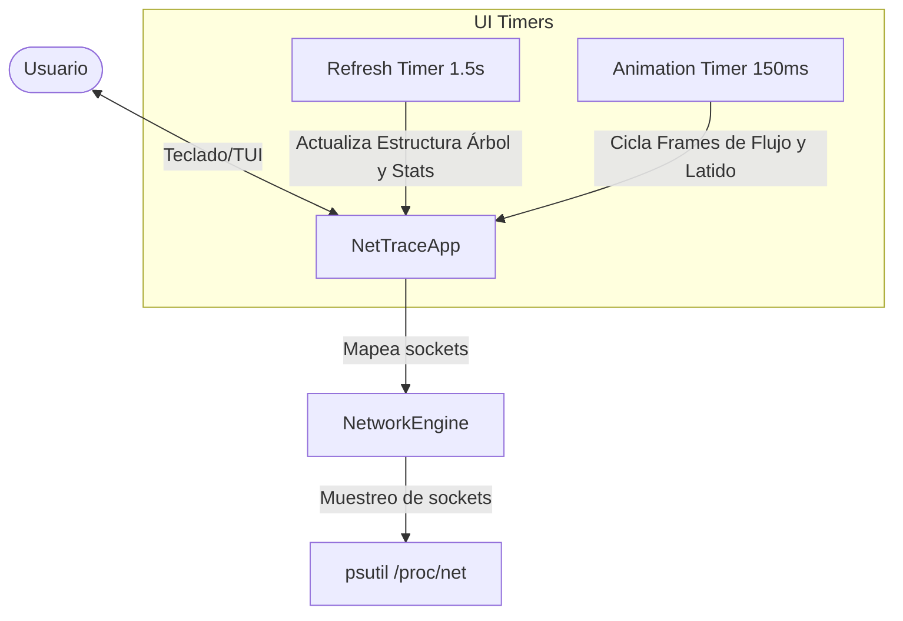

# Net-Trace ⚡ Live Linux Network Monitor TUI

**Net-Trace** es una herramienta de monitorización de red en tiempo real diseñada para la terminal Linux. Combina una arquitectura de recopilación de datos eficiente en Python con un diseño de interfaz de terminal (TUI) moderno, interactivo y dinámico impulsado por el framework **Textual**.

## 🚀 Características Clave

- **Agrupación Jerárquica**: Los sockets de red se agrupan de forma lógica: **Proceso/PID** → **Puerto Local** → **Destino Remoto**.
- **Animación Dinámica de Flujo**:
  - `ESTABLISHED`: Visualización de flujo de paquetes continuo (`──❯───❯──`) en el color asignado a la aplicación.
  - `LISTEN`: Visualización de "latido" o pulsación analógica (`  (░)  ` ➔ `  (█)  `) en azul eléctrico para sockets a la escucha.
  - `SYN_SENT`/`SYN_RECV`: Animación de flujo rápido (`──►──►──`) en naranja para conexiones en curso.
  - Otros estados: Símbolos estáticos simplificados para evitar saturación visual.
- **Colorización Inteligente**: Cada proceso recibe un color neon único y estable a través de hashing, lo que permite seguir sus conexiones visualmente sin esfuerzo.
- **Filtro Interactivo**: Alterna en caliente entre conexiones únicamente establecidas (`ESTABLISHED`) y todas las conexiones activas (`LISTEN`, `TIME_WAIT`, `SYN_SENT`, etc.) pulsando la tecla `[c]`.
- **Diseño Ultra-Premium**: Interfaz responsiva con panel de estadísticas del sistema en tiempo real, leyenda visual, advertencias dinámicas de privilegios (root/sudo) y atajos rápidos.

---

## 🛠️ Requisitos e Instalación

### Requisitos del Sistema
- Python 3.8 o superior.
- Sistema Operativo Linux (para acceso a `/proc/net/` y mapeo de procesos).

### Pasos de Instalación

1. **Crear y activar el entorno virtual de Python**:
   ```bash
   python3 -m venv venv
   source venv/bin/activate
   ```

2. **Instalar dependencias**:
   ```bash
   pip install -r requirements.txt
   ```

---

## 💻 Ejecución

Para una monitorización básica de tus propios procesos:
```bash
./venv/bin/python net_monitor_tui.py
```

### 🛡️ Recomendación de Seguridad y Privilegios (Sudo)
En Linux, los sockets abiertos por procesos pertenecientes a otros usuarios (o servicios del sistema como Docker, Nginx, Systemd, etc.) requieren privilegios de superusuario para mapear el ID del proceso (`PID`) al nombre de la aplicación.

Para obtener la visibilidad completa del sistema, ejecuta la herramienta usando el intérprete del entorno virtual con `sudo`:
```bash
sudo ./venv/bin/python net_monitor_tui.py
```
*(Si ejecutas sin sudo, la aplicación funcionará perfectamente pero agrupará las conexiones inaccesibles bajo la etiqueta `System / Unknown (Need Sudo)`).*

---

## ⌨️ Atajos de Teclado (Hotkeys)

| Tecla | Acción |
| :---: | --- |
| **`c`** | Alterna el filtro (Conexiones `ESTABLISHED` únicamente / Todos los Estados) |
| **`r`** | Fuerza un escaneo manual instantáneo de la red |
| **`f`** | Expande o colapsa todas las ramas del árbol de conexiones |
| **`q`** | Cierra la aplicación de forma segura |

---

## 📐 Arquitectura del Sistema



---

## 📁 Estructura del Proyecto

- `network_engine.py`: Motor lógico de red. Lee sockets activos de forma eficiente, resuelve metadatos de procesos, maneja permisos y caches para optimizar rendimiento.
- `net_monitor_tui.py`: Frontend interactivo en Textual. Define la vista, lógica del árbol, animaciones dinámicas y atajos de teclado.
- `requirements.txt`: Dependencias del proyecto (`textual` y `psutil`).


## 📄 Licencia

Este proyecto se distribuye bajo la Licencia MIT. Consulta el archivo `LICENSE` para más detalles.