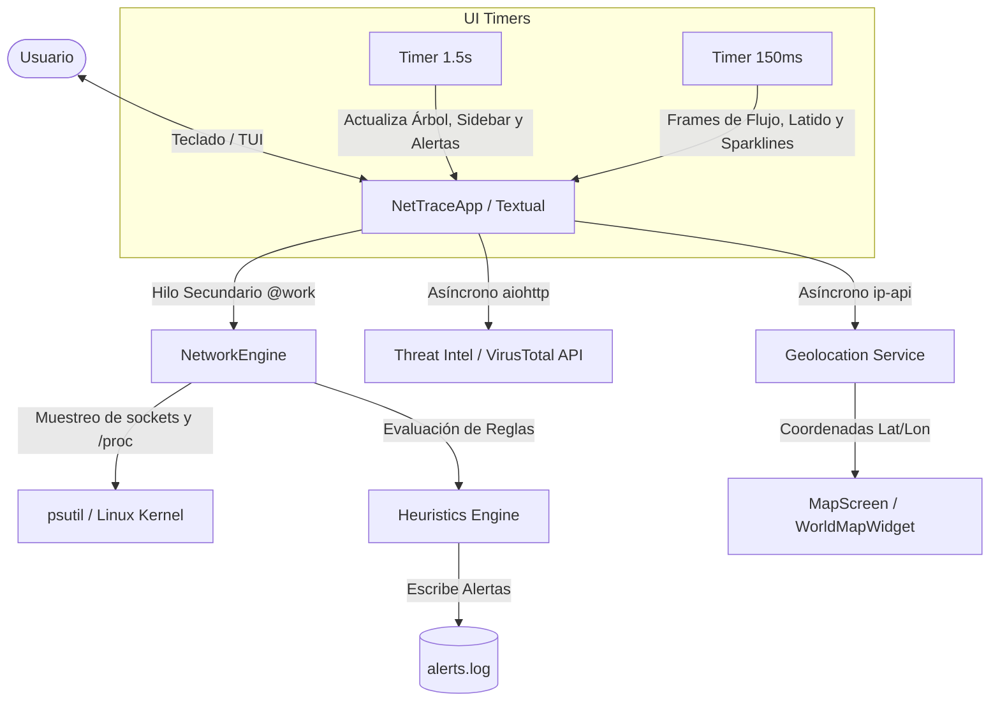

# GCOCO HIDS/IPS ⚡ Real-Time Linux Network Monitor & Intrusion Detection System

**GCOCO HIDS/IPS** es un sistema avanzado de detección y prevención de intrusiones en host (HIDS/IPS) combinado con un monitor de red en tiempo real para entornos Linux. Integra una arquitectura asíncrona y multinivel en Python con una interfaz de terminal (TUI) interactiva, moderna y dinámica impulsada por el framework **Textual**.

---

## 🚀 Características Clave

### 🔍 Monitorización de Red y Jerarquía de Conexiones
- **Estructura Árbol Lógica**: Los sockets activos se agrupan en: **Proceso / PID** → **Puerto Local** → **Destino Remoto**.
- **Animaciones Dinámicas de Flujo**:
  - `ESTABLISHED`: Visualización de flujo de paquetes contínuo (`──❯───❯──`) codificado por color según la aplicación.
  - `LISTEN`: Animación de pulsación analógica (` (░) ` ➔ ` (█) `) para sockets a la escucha.
  - `SYN_SENT` / `SYN_RECV`: Animación de flujo acelerado (`──►──►──`) para conexiones en establecimiento.
  - **Sparklines de Tráfico**: Animación de espectro en tiempo real para conexiones con IPs públicas.
- **Colorización Inteligente**: Cada proceso recibe un color neón único derivado por hashing para facilitar su identificación visual.
- **Filtro de Estados**: Alterna en caliente entre conexiones únicamente establecidas (`ESTABLISHED`) y todos los estados (`LISTEN`, `TIME_WAIT`, `SYN_SENT`, etc.) mediante la tecla `[c]`.

### 🛡️ Motor de Heurísticas de Seguridad (HIDS)
Detección automática en tiempo real con resaltado en rojo parpadeante (`☠ ALERT ☠`) y propagación de alertas desde la conexión individual hasta el proceso raíz:
- **`[REV_SHELL]` (Reverse Shell)**: Detecta intérpretes de comandos o lenguajes (`bash`, `sh`, `python`, `nc`, `perl`, `ruby`, `node`, `php`) conectados a puertos remotos no estándar.
- **`[EXFILTRATION]` (Exfiltración de Datos)**: Monitoriza los bytes escritos (`/proc/<pid>/io`) por procesos no incluidos en la lista blanca y alerta cuando superan el umbral de subida configurado.
- **`[SCANNING]` (Escaneres de Red)**: Identifica ráfagas o barridos de puertos basados en un volumen elevado de conexiones en estado `SYN_SENT` desde un mismo PID.
- **`[BACKDOOR]` (Puertas Traseras / Puertos No Autorizados)**: Detecta procesos escuchando en puertos locales distintos a los permitidos en la configuración.

### 🌐 Integración con Threat Intelligence & Geolocalización
- **VirusTotal API v3**: Consulta asíncrona en segundo plano del nivel de reputación de IPs públicas remotas con gestión inteligente de cuotas, reintentos y caché LRU (`cachetools`). Las IPs maliciosas son marcadas como `[MALICIOUS_IP]`.
- **Mapa ASCII de Geolocalización Global**: Interfaz de mapa interactivo a pantalla completa (tecla **`[m]`**) que proyecta mediante coordenadas equirectangulares:
  - `★` Posición del host origen (Neón Cyan).
  - `•` Destinos remotos activos limpios (Neón Green).
  - `☠` Destinos remotos identificados como maliciosos o sospechosos (Rojo parpadeante).

### ⚡ Sistema de Prevención de Intrusiones (IPS Kill Switch)
- **Neutralización Inmediata**: Selecciona cualquier nodo del árbol (proceso, puerto o conexión) y presiona **`[k]`** para enviar una señal `SIGKILL` al proceso malicioso y removerlo del sistema en tiempo real.

### 📋 Registro Forense y Panel de Alertas
- **Forensic Audit Log (`alerts.log`)**: Registro persistente en formato JSON delimitado por líneas para auditorías de seguridad e investigación forense.
- **Panel de Alertas en Tiempo Real**: Vista inferior en la TUI con los últimos 10 eventos de seguridad detectados.

---

## 🛠️ Requisitos e Instalación

### Requisitos del Sistema
- Python 3.8 o superior.
- Sistema Operativo Linux (requerido para lectura de `/proc/` y mapeo de sockets por proceso).

### Instalación

1. **Clonar el repositorio y acceder al directorio**:
   ```bash
   git clone https://github.com/augustogh/gcoco.git
   cd gcoco
   ```

2. **Crear y activar el entorno virtual**:
   ```bash
   python3 -m venv venv
   source venv/bin/activate
   ```

3. **Instalar dependencias**:
   ```bash
   pip install -r requirements.txt
   ```

---

## ⚙️ Configuración (`config.yaml`)

El comportamiento del motor HIDS se gestiona mediante el archivo `config.yaml`:

```yaml
# Umbral de exfiltración de datos (en bytes) antes de activar [EXFILTRATION]
max_upload_bytes: 10485760  # 10 MB

# Lista blanca de binarios autorizados a exceder el umbral de exfiltración
binary_whitelist:
  - "/usr/sbin/sshd"
  - "/usr/bin/ssh"
  - "/usr/lib/systemd/systemd"
  - "/usr/bin/curl"
  - "/usr/bin/wget"
  - "/usr/bin/git"

# Puertos autorizados para escuchar (LISTEN). Otros puertos activan [BACKDOOR]
allowed_listening_ports:
  - 22
  - 80
  - 443
  - 8080

# Clave de API de VirusTotal (Opcional, para análisis de reputación de IPs)
vt_api_key: ""
```

---

## 💻 Ejecución y Privilegios

Para iniciar la aplicación principal:

```bash
sudo ./venv/bin/python main.py
```

### 🛡️ Nota sobre Privilegios Root (`sudo`)
Para mapear sockets pertenecientes a otros usuarios o servicios del sistema (como Docker, Systemd, Nginx, etc.) a sus PIDs y ejecutables correspondientes, Linux exige permisos de superusuario.

*Si ejecutas la herramienta sin `sudo`, funcionará correctamente pero las conexiones sin acceso se agruparán bajo la etiqueta `System / Unknown (Need Sudo)` y no se podrán aplicar ciertas heurísticas de proceso ni el Kill Switch.*

---

## ⌨️ Atajos de Teclado (Hotkeys)

| Tecla | Acción |
| :---: | --- |
| **`c`** | Alterna el filtro entre conexiones `ESTABLISHED` y `ALL STATES` |
| **`r`** | Fuerza un escaneo manual e instantáneo de sockets |
| **`f`** | Expande o colapsa todas las ramas del árbol de conexiones |
| **`k`** | **Kill Switch**: Elimina el proceso seleccionado mediante `SIGKILL` |
| **`m`** | Abre / Cierra el mapa mundial interactivo de geolocalización |
| **`q`** | Cierra la aplicación de forma segura |

---

## 📐 Arquitectura del Sistema



---

## 📁 Estructura del Proyecto

- `main.py`: Punto de entrada de la aplicación TUI (Textual). Controla pantallas, eventos asíncronos, renderizado del árbol y panel de alertas.
- `engine.py`: Motor principal de red y gestión de procesos. Lee sockets, maneja cachés y ejecuta el Kill Switch.
- `heuristics.py`: Motor de detección de amenazas HIDS (`[REV_SHELL]`, `[EXFILTRATION]`, `[SCANNING]`, `[BACKDOOR]`) y registro forense en `alerts.log`.
- `threat_intel.py`: Cliente asíncrono para VirusTotal API v3 y servicio de geolocalización IP con caché TTL.
- `ui_map.py`: Widget y pantalla interactiva del mapa mundial en proyección equirectangular ASCII.
- `config.yaml`: Archivo de configuración YAML con listas blancas, umbrales y claves de API.
- `test_hids.py`: Suite de pruebas unitarias para validar las heurísticas de detección.
- `requirements.txt`: Dependencias de Python (`textual`, `psutil`, `aiohttp`, `pyyaml`, `cachetools`).

---

## 🧪 Verificación y Tests

Puedes ejecutar la suite de pruebas unitarias para verificar el correcto funcionamiento del motor de heurísticas HIDS:

```bash
./venv/bin/python test_hids.py
```

---

## 📄 Licencia

Este proyecto se distribuye bajo la Licencia MIT. Consulta el archivo `LICENSE` para más detalles.